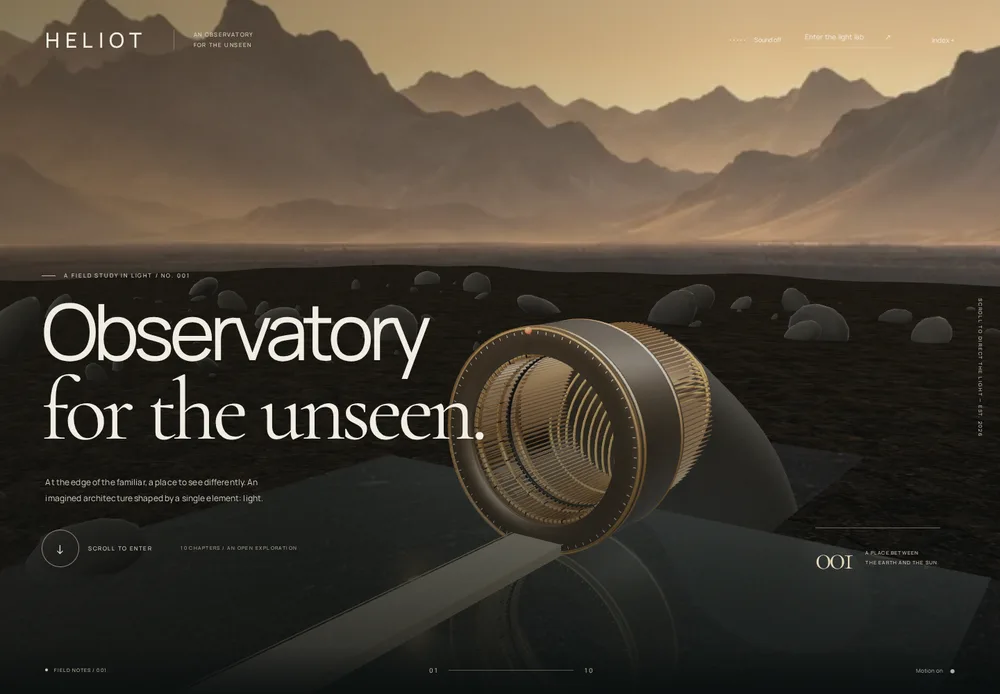
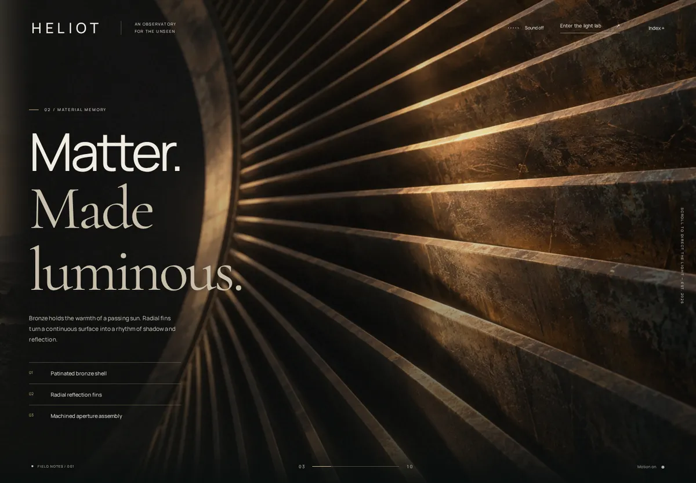
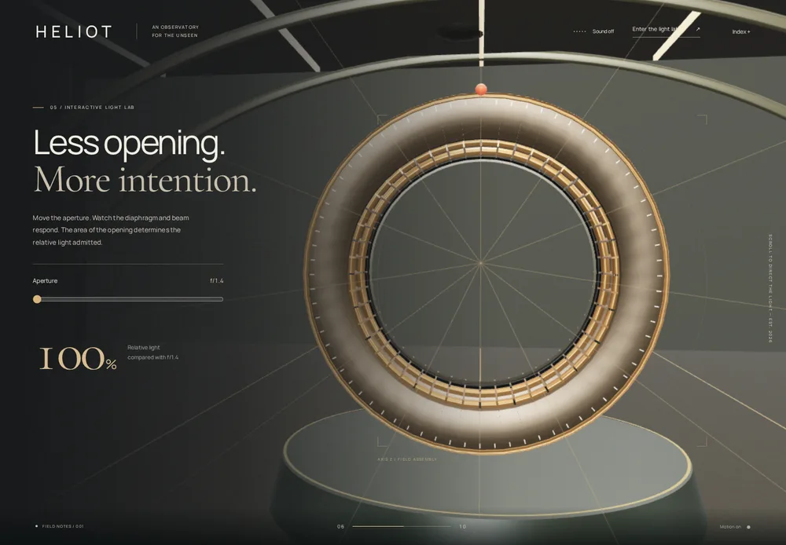
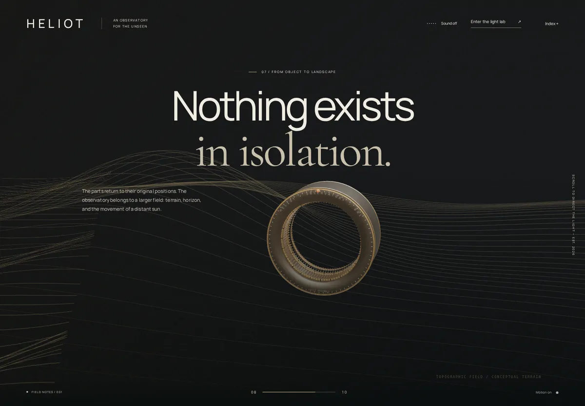
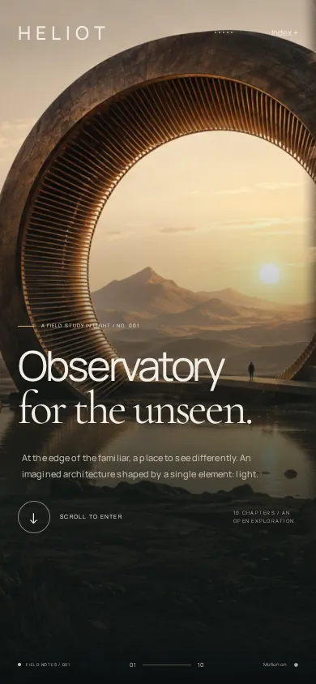
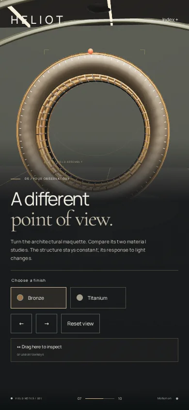

# Observatory visual review

Production Chromium captures. Desktop: 1440×1000; phone: 390×844. The retained WebP files are reduced-size review copies, not runtime assets.

## Arrival

## Material macro

## Interactive aperture laboratory

## Return to the landscape

## Phone compositions

The complete automated capture covered all ten chapter holds at both sizes. No JavaScript errors or horizontal overflow were reported. The terrain composition was refined after this review to separate the editorial content from the maquette. Render-cost observations peaked at 20 draw calls, 18,796 triangles and 4,480 line segments; physical-device frame rate and Safari remain unmeasured.
