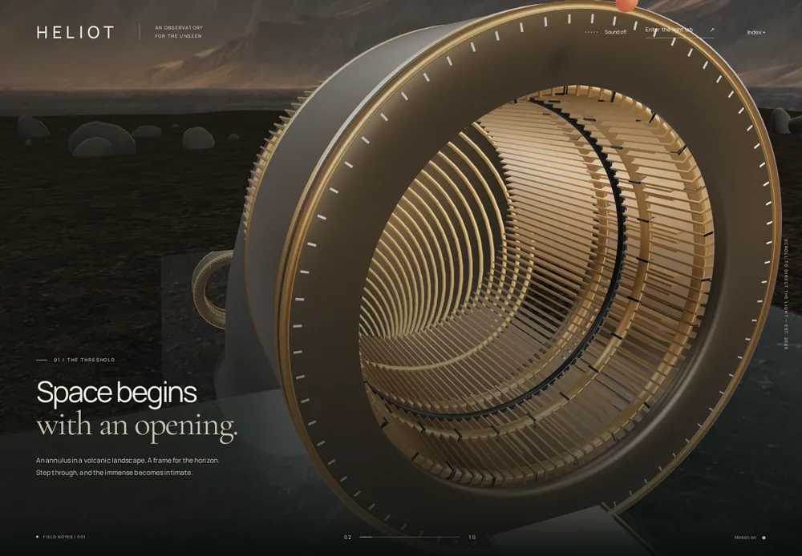
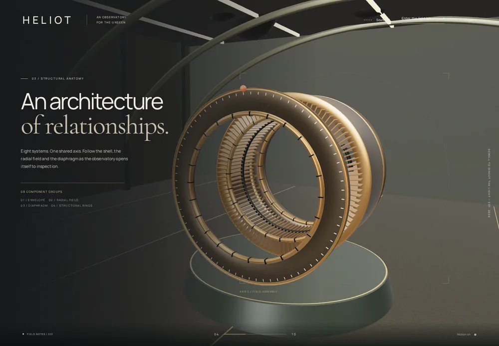

# Spatial flight review

Production Chromium captures. Desktop: 1440×1000; phone: 390×844. The retained WebP files are reduced-size review copies, not runtime assets. The journey now traverses actual architecture. The distant mountain backdrop is an original matte on a world-space cylinder.

## Arrival

## Cross the gateway

## Descend inside

## Underground gallery

## Interactive aperture laboratory

## Return to the landscape

## Phone compositions

The renderer rests when a shot settles and wakes for scroll, pointer, aperture and inspection input. Low quality reduces geometry density and disables shadow maps. Captures use software WebGL; they do not establish physical-device frame rate or Safari compatibility. The final header also includes an additional contrast gradient for legibility over bright skies.
